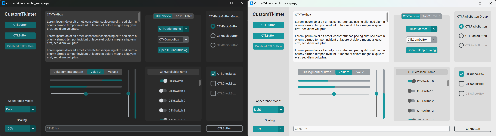

                         
<br/>
<div align="center">
<a href="https://github.com/ShaanCoding/ReadME-Generator">

</a>
<h3 align="center">CustomTkinter Themes</h3>
<p align="center">
CustomTkinter themes that allow more themes to use for your application!
<br/>
<br/>
<a href="https://github.com/Mason-Dino/CTk-themes/tree/main/themes"><strong>Explore the themes »</strong></a>
<br/>
<br/>
  

<a href="https://github.com/Mason-Dino/CTk-themes/issues/new?labels=enhancement&template=feature-request---.md">Request a Theme</a>
</p>
</div>

 ## About The Project

CustomTkinter Themes is a github repository that allows a greater customization of themes that allows you to have more control of your CustomTkinter application. To see all pictures of the different themes I developed go to [here]()

 ## Installation

To use the CustomTkinter themes I have developed download the theme file that you want and save it to your project!

1. Download CustomTkinter
    ```sh
    pip install customtkinter
    ```
2. Use the theme you downloaded
   ```py
   customtkinter.set_default_color_theme("path/to/your/custom_theme.json")
   ```
 ## Usage

You can use this repository for your own projects that use CustomTkinter python library. All that I ask is that you give me credit for all the themes except blue, dark-blue, and green themes. 

## Themes
### Choices
- [Orange](https://github.com/Mason-Dino/CTk-themes?tab=readme-ov-file#orange)
- [Purple](https://github.com/Mason-Dino/CTk-themes?tab=readme-ov-file#purple)
- [Red](https://github.com/Mason-Dino/CTk-themes?tab=readme-ov-file#red)
- [Teal](https://github.com/Mason-Dino/CTk-themes?tab=readme-ov-file#teal)
- [Yellow](https://github.com/Mason-Dino/CTk-themes?tab=readme-ov-file#yellow)
- [Grey](https://github.com/Mason-Dino/CTk-themes?tab=readme-ov-file#grey)

### Orange
Below is the orange color theme both in the dark and light color mode.


### Purple
Below is the purple color theme both in the dark and light color mode.


### Red
Below is the red color theme both in the dark and light color mode.


### Teal
Below is the teal color theme both in the dark and light color mode.


### Yellow
Below is the yellow color theme both in the dark and light color mode.


### Grey
Below is the grey color theme both in the dark and light color mode.


 ## Contributing

If you would like to make your own theme or have an idea for a color of a theme please make issue with a enhancement tag or fork the project with your color theme!

1. Fork the Project
2. Create your Feature Branch (`git checkout -b feature/AmazingTheme`)
3. Commit your Changes (`git commit -m 'Add some AmazingTheme'`)
4. Push to the Branch (`git push origin feature/AmazingTheme`)
5. Open a Pull Request
 ## License

Distributed under the MIT License. See [MIT License](https://github.com/Mason-Dino/CTk-themes/blob/main/LICENSE) for more information.
 ## Contact

Your Name - mason.n.dinosaur@gmail.com

Project Link: [https://github.com/Mason-Dino/CTk-themes](https://github.com/Mason-Dino/CTk-themes)
